# User flows

These are the paths a person actually takes. If a screen or action is not on one of these paths, question whether it belongs in v1.

Keep the diagrams aligned with `version-model.md`. If a flow and the version model disagree, fix one of them on purpose.

A user is a Git repository. A variant is a Git branch. A version is a Git commit. Draft is a version whose message is `unsaved`.

## Map of the main screen

Once the open user has at least one variant, the window has four jobs:

1. **Current user** — see who is open, switch user, add a user.
2. **Sidebar** — find variants, open a variant, open a version, see Draft.
3. **Document tabs** — move between the resume and any other HTML documents on that version.
4. **Split view** — HTML on the left, rendered preview on the right.

Export, Sync, and Settings live at the top right of the main screen, not inside the sidebar.

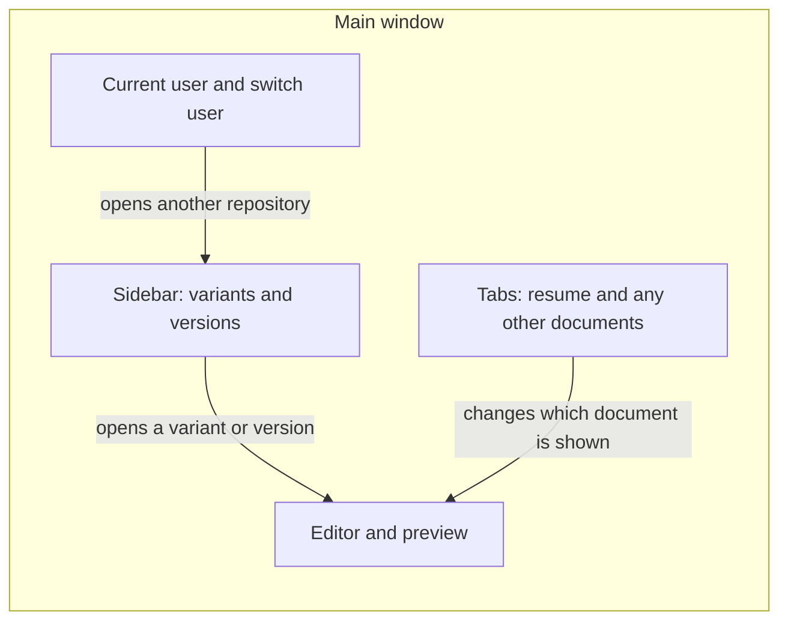

## First launch, nothing here yet

There are no users yet.

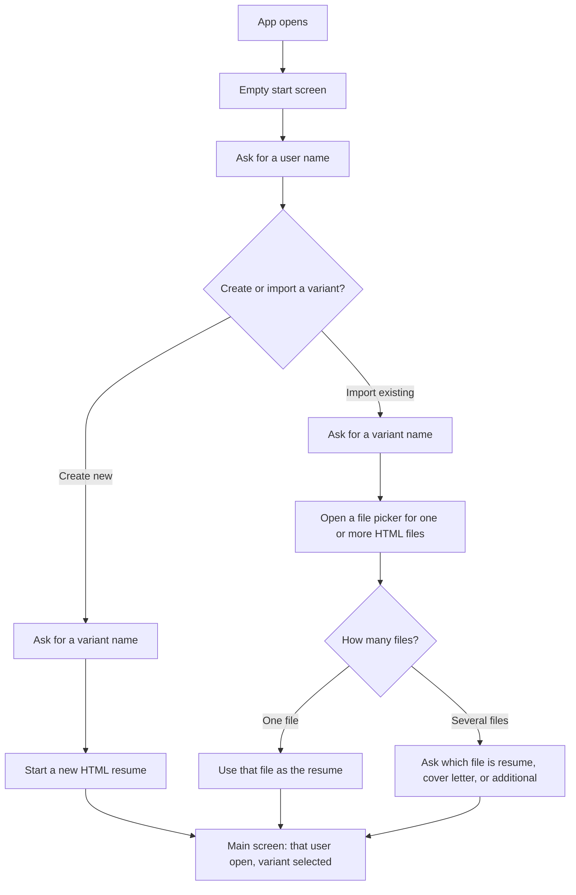

Rules for this path:

- The first name is the user name. That creates the first repository.
- The second name is the variant name and the Git branch name.
- Import accepts HTML only, and only while this user has no variants yet.
- One file becomes the resume. Several files go through a mapping modal: each file is resume, cover letter, or an additional document.
- Do not create a cover letter or additional document that was not imported or added.
- After the first variant exists, this import path is closed.
- After either choice, that user is open, the new variant is selected, and the resume tab is open.
- The left panel shows editable HTML. The right panel shows that HTML rendered.

## Opening the app when work already exists

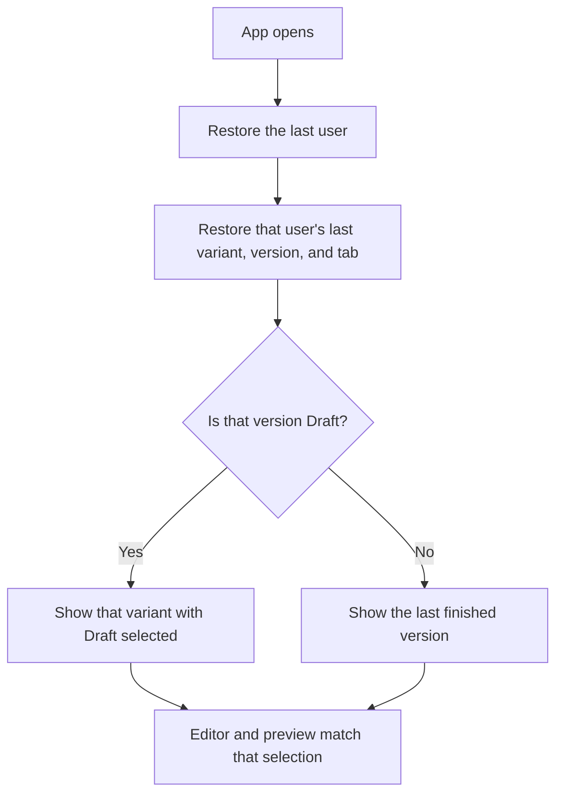

Do not send anyone back through first-run create / import unless there are no users, or the open user has no variants.

## Switch user

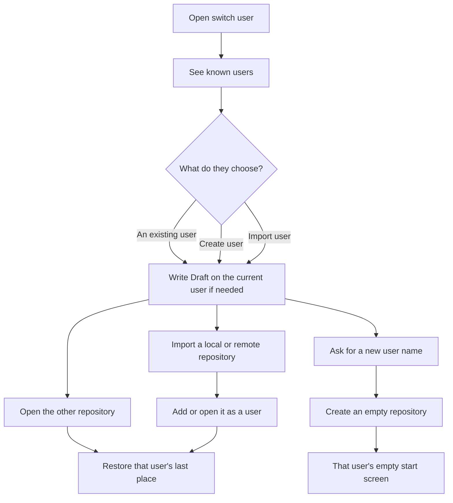

Rules for this path:

- Switching user opens another repository. It does not mix the two workspaces.
- Write the current user first. If that write fails, do not switch.
- A new user starts empty. They create or import a variant from that user's empty screen.
- Importing a repository adds a user. It does not fold those files into the user who was already open.

## Browse variants and versions

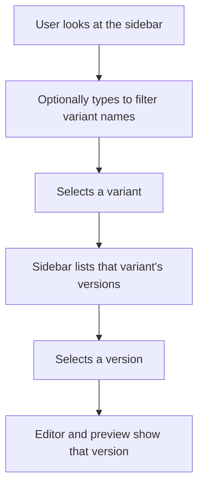

If the current files differ from the selected version, selecting another variant, version, or user follows the write-before-switch path below.

## Create a later variant from a version

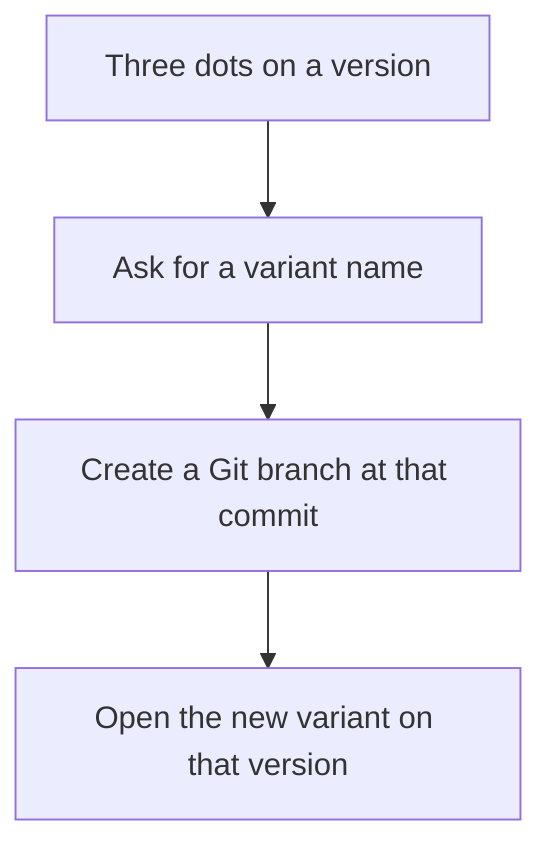

This is the only way to add a variant after the user already has work. The three-dot control is on a finished version, not on Draft. The new branch starts at the chosen commit, not at the tip of some other branch and not from an empty tree. The new variant lists that starting version and later versions on this line only. Older parent versions stay on the variant they came from.

## Delete Draft

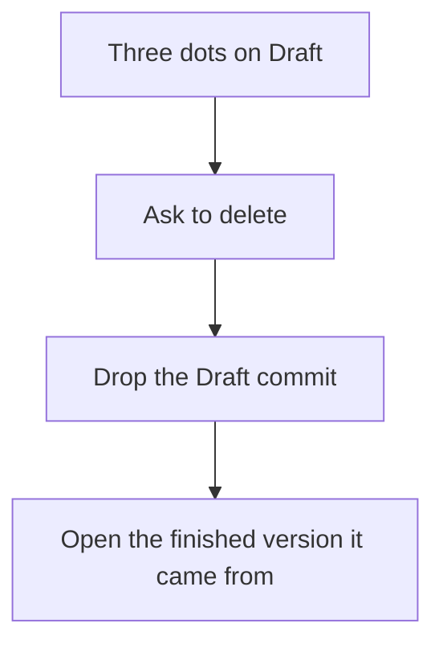

This is the only way unnamed work is thrown away. Save still names it. Switch and quit still write it.

## Edit a finished version

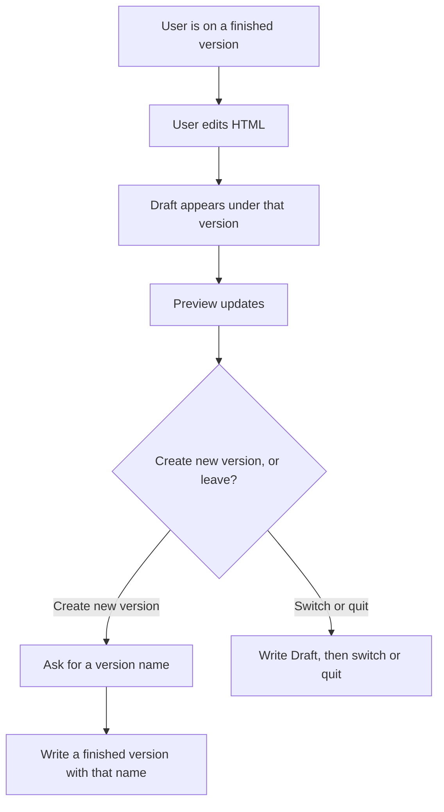

The Draft row is a real version: a Git commit with message `unsaved`. It must appear as soon as the files differ. This path works from any finished version on the variant, not only the latest. Create new version names that work and keeps it on the same variant. Versions that were already there stay listed. Switching and quitting keep unnamed work as Draft.

## Keep editing Draft

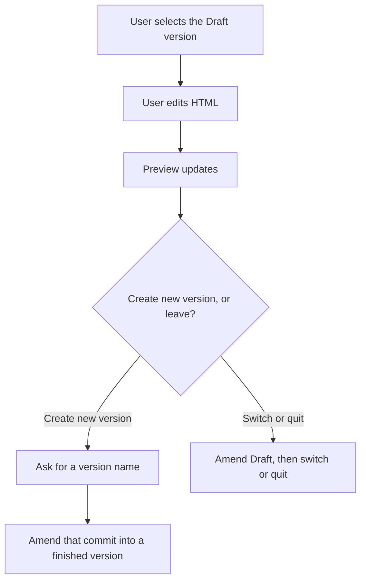

Selecting Draft and continuing amends that commit. Do not stack a second Draft under the first.

## Leave or quit with unwritten files

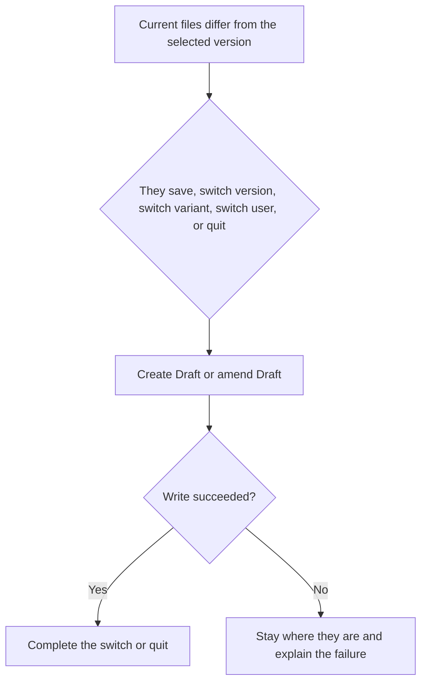

This is one path with those triggers. Create or amend depends only on whether Draft already exists for this edit.

## Move between documents

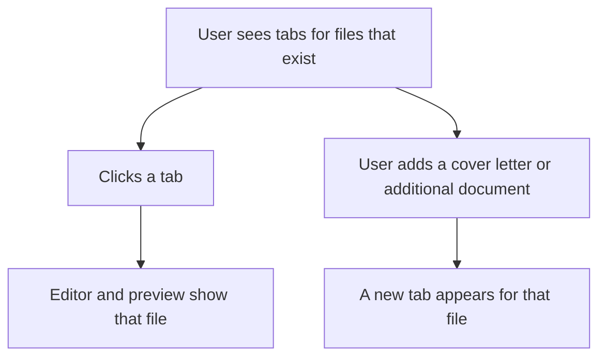

Tab changes should feel instant and local:

- Same variant.
- Same version, including Draft.
- Only the editor and preview content change.

Edits in any tab belong to the current version. Adding a file on a finished version creates Draft. Adding a file on Draft amends it.

There is no empty cover letter tab and no reserved additional tab. Those appear after the user creates or imports them. Additional documents have no limit.

## Export a PDF

```mermaid
flowchart TD
  click[User clicks export at the top right]
  modal[Modal lists every document on the open variant]
  rows[Accordion rows for resume name, save location, and files]
  pick[User can deselect files]
  confirm[User confirms]
  wait[Modal shows a loader]
  write[Write a folder of PDFs]
  done[Return to the main screen]

  click --> modal --> rows --> pick --> confirm --> wait --> write --> done
```

Defaults:

- Folder: the user's Downloads folder, unless they have set a default.
- Resume file name: remembered on that user after an export.
- Files: every document on the open variant, each checked.

The PDFs land in a folder named from the resume file name, inside the save location. Collapsed accordion rows show the current value after a colon. The chevron sits on the left of the label. The modal stays up with a loader until the write finishes.

## Set a remote and sync

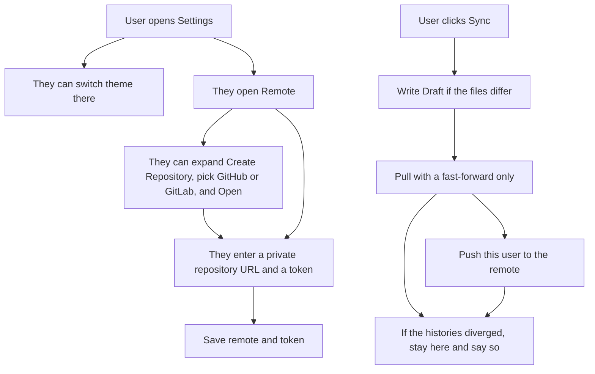

Rules for this path:

- The token is stored in the catalog, never in the user's Git repository.
- The remote URL is stored as `origin` on this user.
- Sync writes first, then pulls (fast-forward only), then pushes.
- Sync stays reachable in a narrow window.

## Take the open user elsewhere

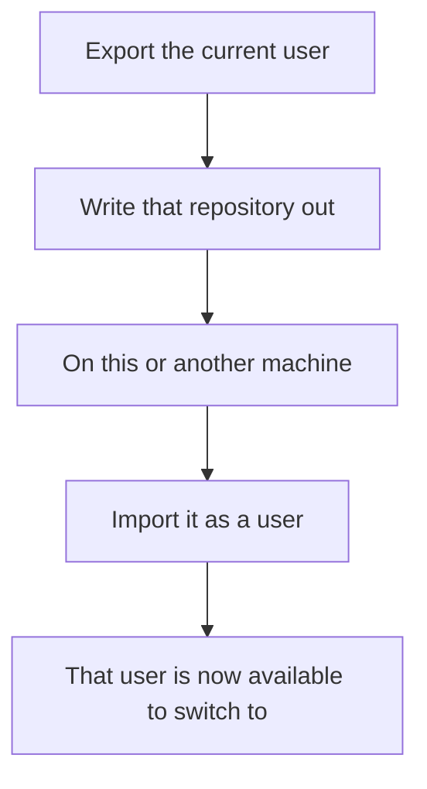

Export copies the open user's Git repository, including `.git`. Import opens that folder, or another Git repository, as a user. v1 does not merge that repository into a user who is already open.

## What good feels like

- First sitting is short. User name, then a variant, then work.
- The chrome always answers: which user, which variant, which version, is anything unsaved.
- Switching user feels like changing person, and the work on the other side is completely separate.
- The split view always answers: what does this HTML look like.
- Leaving is safe. The app would rather block a switch than throw work away.
